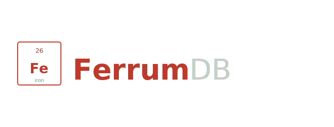

<p align="center">
  
</p>

# FerrumDB

FerrumDB is an embedded, no-SQL key-value storage engine written in Rust. It stores byte values under byte keys, organized into named tables, with durable writes and crash recovery — without a query language and without a server. It is meant to be linked directly into an application, the way SQLite is.

The target is the space that SQLite owns for relational data, applied to key-value workloads: IoT devices, edge nodes, mobile applications, and local-first software that needs a lightweight but correct persistent store.

---

## Usage (Rust)

The public API lives in the `ferrumdb` crate (the `ferrumdb-core` crate is the engine it wraps). Keys and values are arbitrary byte slices.

```rust
use ferrumdb::Database;

let mut db = Database::open("./data/app")?;
db.create_table("users")?;

let mut users = db.table("users")?;
users.put(b"user:42", b"alice")?;
assert_eq!(users.get(b"user:42")?, Some(b"alice".to_vec()));

// Atomic batch — all of these land, or none do (one fsync).
users.put_batch(&[(b"user:1", b"bob"), (b"user:2", b"carol")])?;
let found = users.get_batch(&[b"user:1", b"user:42"])?;

// Sorted scans.
let everything = users.scan()?;                  // all pairs, ascending
let some = users.range(b"user:1", b"user:3")?;   // half-open [start, end)
let by_prefix = users.scan_prefix(b"user:")?;    // keys starting with "user:"

// Interactive transaction: read-your-writes, then commit or roll back.
let mut tx = users.transaction();
tx.put(b"user:9", b"dan");
assert_eq!(tx.get(b"user:9")?, Some(b"dan".to_vec())); // sees its own write
tx.commit()?;                                          // atomic, one fsync

users.delete(b"user:42")?;
# Ok::<(), ferrumdb::Error>(())
```

The API surface is deliberately small: `Database` (`open`, `create_table`, `table`, `delete_table`, `list_tables`) and `Table` (`put`, `get`, `delete`, `contains`, `put_batch`, `get_batch`, `scan`, `range`, `scan_prefix`, `transaction`). C/Python bindings are planned (see Roadmap).

---

## Architecture

FerrumDB follows the **LSM-tree** (Log-Structured Merge-Tree) model, the same architecture used by LevelDB and RocksDB:

```
write
  │
  ├─ WAL (append-only log, fsynced on commit)  ← durability + atomicity
  └─ BTreeMap memtable (sorted, in RAM)         ← fast access
       │
       └─ flush when full
            │
            └─ SSTable (immutable sorted file on disk)
                 │
                 └─ compaction (merge SSTables, reclaim space)  ← [not yet implemented]
```

Reads check the memtable first, then SSTables from newest to oldest.

The `BTreeMap` is the memtable — it keeps keys in sorted order so that flushing to SSTable is a single in-order iteration with no extra sorting step.

---

## What Has Been Built

### Write-Ahead Log (WAL)

Every `PUT` and `DELETE` is appended to the WAL before touching in-memory state. The format is length-prefixed binary records (8-byte big-endian length followed by a protobuf payload), which makes truncated-tail detection safe after a crash.

Each entry carries a key, a typed value, and a monotonically increasing sequence number. A `COMMIT` entry marks the end of a transaction — entries without a following COMMIT are discarded on replay.

### Atomic Transactions

Operations can be grouped into explicit transactions:

```rust
let mut tx = store.begin_transaction();
tx.set_value("a".to_string(), Value::Integer(1));
tx.set_value("b".to_string(), Value::Integer(2));
tx.commit()?; // one fsync covers the entire batch
```

All entries are buffered in memory, written to the WAL together, then a single COMMIT marker is fsynced. Either all writes land or none do. Dropping a transaction without committing is a free rollback — nothing reaches disk.

Single-operation writes (`set_value`, `delete_value` directly on `Store`) are implicitly wrapped in their own commit and behave the same way.

### ACID Foundation

FerrumDB has a credible single-node ACID story for an embedded engine:

- **Atomicity** — multi-operation transactions via COMMIT marker in the WAL.
- **Consistency** — the BTreeMap only ever contains committed state.
- **Isolation** — one writer at a time via an exclusive file lock held for the lifetime of the `Store`. The borrow checker enforces single-transaction-at-a-time at compile time.
- **Durability** — every commit ends with an fsync. Crash recovery replays the WAL on next open.

The file lock is implemented with a direct `flock` syscall via `extern "C"` — zero crate dependencies, standard on every Linux target FerrumDB runs on.

### Store and Recovery

The `Store` struct owns the WAL, the memtable, the SSTables, and the lock:

- `set_value` and `delete_value` write to the WAL first, then update the memtable. In-memory state is never modified unless the WAL write succeeds.
- `flush()` writes the memtable to a new SSTable and clears the WAL (see SSTable Layer below). It replaces the earlier snapshot mechanism.
- `open_with_dir()` discovers the table's SSTables, replays uncommitted WAL entries on top, and sets the sequence counter to the highest value seen so new writes never reuse old sequence numbers.

### Table Model

Each table is an independent `Store` instance with its own files under `./data/<table>/`:

```
./data/users/
  ├── wal.log           ← committed writes since the last flush
  ├── LOCK              ← exclusive lock, held while the table is open
  └── sstable_*.sst     ← immutable on-disk tables (newest id wins)
```

Opening a table that is already open by another process fails immediately with an error. Different tables can be opened simultaneously without interference.

### Performance Baseline

Measured on an Apple Mac mini (APFS), 1000-key workloads:

| Operation | Debug | Release | Bound by |
|---|---|---|---|
| Single durable write | ~107/sec | ~100/sec | `fsync` (~9–10 ms/commit) |
| Batched transaction (1000 writes, 1 fsync) | ~950/sec | ~1,200/sec | per-append CPU + one write syscall |
| Read (in-memory) | ~0.5M/sec | ~0.9–1.9M/sec | CPU |
| Absent-key read (on-disk SSTable) | — | ~5–12M/sec | CPU (bloom skip) |
| Present-key read (on-disk SSTable) | — | ~170k/sec | CPU (in-block scan) |
| Recovery (WAL replay) | ~70–150k/sec | ~180–250k/sec | CPU |
| Flush 1000 entries → SSTable | ~21 ms | ~15 ms | CPU |

- **Single writes are `fsync`-bound.** Every commit fsyncs, and APFS fsync is ~9–10 ms (it is ~1–5 ms on the Linux embedded storage FerrumDB actually targets). This is the same wall every durable embedded engine hits on the same hardware — the release build does not change it. The WAL holds its file handle open, so a write no longer pays for opening the log; the fsync is all that's left.
- **Batched writes** amortize a single fsync over the whole batch and now reach ~1,200/sec — a 6× gain from the WAL file-handle reuse (previously ~190/sec, when every append reopened the log).

Reads are currently served from the in-memory memtable. Once data ages into SSTables, reads involve disk plus the per-SSTable key-range skip; bloom filters and a block cache (Roadmap) are what will keep that fast.

### SSTable Layer

The memtable is flushed to immutable on-disk SSTables, which is what bounds memory on constrained devices. Each SSTable (`ferrumdb-core/src/sstable.rs`) is ~4 KB data blocks each protected by a CRC32, a sparse index (one entry per block), and a fixed footer carrying a magic number and format version. A reader loads only the footer and sparse index into RAM, then serves a point lookup with a single binary search and one block read. Full byte-level spec in [docs/sstable.md](docs/sstable.md).

- **Flush** — `Store::flush()` writes the whole memtable to a new SSTable, then clears the memtable and the WAL. An automatic flush fires once the memtable's live size passes a **byte budget** (tunable per table via `set_memtable_budget`), so memory stays bounded regardless of how much is written.
- **Layered reads** — a lookup checks the memtable first, then SSTables newest→oldest; the first hit wins. A tombstone in a newer layer shadows an older value. Before any disk read, each SSTable is skipped if the key is outside its **key range** or rejected by its **bloom filter** — both checks are in RAM. When a block must be read, a small per-SSTable **block cache** keeps hot blocks in memory.
- **Crash safety** — the SSTable is fsynced before the WAL is cleared, so a crash in between is safe (the WAL entries simply replay on top of the SSTable).

SSTable flush replaces the earlier snapshot mechanism as the single path to disk.

### Compaction

As SSTables accumulate, reads must consult more files and deleted keys are never reclaimed. `Store::compact()` merges all SSTables into one, keeping the newest value per key and dropping tombstones (a full merge leaves nothing older for a tombstone to shadow). Compaction runs automatically once the SSTable count exceeds a threshold.

The merged SSTable is fsynced **before** the old files are deleted, so a crash in between is safe: the stale tables simply replay behind the newer merged table and lose to it on every read.

### Testing

Integration tests cover nine areas:

- `tests/wal.rs` — append, read-back, persistence across instances, clear
- `tests/recovery.rs` — WAL replay on restart, delete replay, flush clears WAL, recovery after flush, SSTable + WAL combined recovery, sequence continuity, tombstone shadowing across SSTables and from the WAL
- `tests/store.rs` — sorted iteration, sorted order after WAL replay, data survives flush and recovery, set/get/delete correctness, idempotent delete, overwrite stability
- `tests/lock.rs` — double-open rejection, lock release on drop, per-table isolation, LOCK file creation, multi-cycle reacquisition
- `tests/transaction.rs` — commit visibility, rollback on drop and explicit rollback, read-your-writes, crash recovery of committed transactions, uncommitted entry discard, mixed put/delete transactions
- `tests/sstable.rs` — flush/read roundtrip, missing keys, lookup across multiple blocks, tombstone roundtrip, CRC corruption detection, empty table, key-range reporting and out-of-range skip, bloom-filter no-false-negatives and empty-table rejection, block-cache populate-and-serve
- `tests/flush.rs` — flush creates an SSTable and empties the memtable, empty-flush no-op, memtable shadows SSTable, newest SSTable wins, layered read across many SSTables, byte-budget auto-flush bounds the memtable
- `tests/compaction.rs` — merge into one, newest value wins, deleted keys dropped, all-deleted leaves nothing, compaction survives recovery, auto-compaction bounds the SSTable count
- `tests/scan.rs` — full scan sorted, memtable+SSTable merge, half-open range, newest value wins, deleted keys excluded
- `tests/perf.rs` — write throughput, batched transaction throughput, read throughput, absent- and present-key SSTable reads (bloom + block cache), WAL replay time, flush time
- `ferrumdb/tests/api.rs` — the public API: put/get/delete, overwrite, arbitrary byte keys and values, contains, atomic batch put/get, scan/range/prefix, interactive transactions (read-your-writes, commit, rollback), table create/list/delete, invalid table names, persistence across reopen, table independence

---

## Roadmap

### Step 1 — SSTable layer ✅

SSTable flush is what makes FerrumDB viable on memory-constrained embedded devices, and it is now in place.

- ✅ The immutable on-disk SSTable format (blocks, sparse index, CRC, footer) with a reader and writer.
- ✅ Tombstones represented in the memtable and the format.
- ✅ A threshold on the memtable triggers a flush to a new SSTable on disk.
- ✅ Reads check the memtable first, then walk SSTables from newest to oldest.
- ✅ Flush replaces the snapshot mechanism as the single path to disk.

### Step 2 — Buffer manager ✅

- ✅ Track memtable size in bytes rather than entry count.
- ✅ The flush byte budget is tunable per table (`set_memtable_budget`) for the target device.
- ✅ Each SSTable records its key range; a lookup skips any SSTable whose range excludes the key, with no disk read.

### Step 3 — Compaction ✅

- ✅ Compaction merges all SSTables into one, keeping the newest value per key and dropping tombstones and shadowed values.
- ✅ A size-triggered strategy: a full merge runs once the SSTable count exceeds a threshold.
- ✅ Crash-safe: the merged table is fsynced before the old files are removed.

### Step 4 — Engine optimization ✅

The fundamentals are in place; the goal here was to make the engine as fast as it can be *before* an API freezes the hot paths.

- ✅ **WAL file-handle reuse** — the WAL holds its append handle open for its lifetime instead of reopening the log on every append. This took batched writes from ~190 to ~1,200/sec (6×) and also sped up single writes (they no longer pay two file opens on top of the fsync). The recovery path also now truncates any uncommitted tail so a later commit cannot adopt a crashed session's writes.
- ✅ **Bloom filters** — a per-SSTable membership filter (persisted in the file, format v3) that skips block reads for keys definitely absent. Absent-key lookups against on-disk SSTables run at ~in-memory speed (~5–12M/sec on the Mac mini) because they never touch the disk.
- ✅ **Block cache** — a small per-SSTable LRU of decoded data blocks, so repeated reads of hot blocks avoid the disk. The in-block scan was also made allocation-free, together taking present-key SSTable reads to ~170k/sec.

*Group commit was considered and deferred:* it batches independent concurrent commits into one fsync, which needs a multi-threaded writer. FerrumDB is intentionally single-writer, and an explicit transaction already provides "many writes, one fsync," so group commit adds complexity without fitting the model.

### Step 5 — API layer (in progress)

- ✅ A minimal public Rust API (`ferrumdb` crate): a `Database` handle managing named tables, and a `Table` with byte `put`/`get`/`delete`/`contains` and atomic `put_batch`/`get_batch`. Keys and values are arbitrary bytes.
- ✅ Arbitrary binary keys — keys are `Vec<u8>` throughout the engine (memtable, WAL, SSTable), sorted lexicographically.
- ✅ Range scans — `scan` / `range` / `scan_prefix`, merging the memtable with all SSTables (newest value per key, tombstones excluded), skipping SSTables whose key range does not overlap. Materializes the range in memory for now; a streaming, block-ranged iterator is a future optimization.
- ✅ Interactive transactions — `Table::transaction()` buffers writes, supports read-your-writes, and commits atomically (one fsync) or rolls back.
- ⬜ A C FFI layer (`cdylib`) so FerrumDB can be used from C, Swift, and other languages — the same way SQLite is embedded across ecosystems.
- ⬜ Python bindings (via the C layer or PyO3).

---

## Design Notes

**Why LSM and not B-Tree on disk?**

A B-Tree storage engine requires implementing disk pages, page splits, tree rebalancing, and a page cache. LSM separates the problem: writes go to an append-only log and a sorted in-memory buffer; disk files are written once and never modified. The implementation complexity is significantly lower, and LSM write performance is better on flash storage (common in embedded targets) because it avoids random writes.

**Why no SQL?**

SQL requires a parser, a query planner, and a schema layer. For the target use cases — IoT devices, edge nodes, mobile apps — the application already knows its data shape. A typed key-value API with fast key-based access is sufficient and keeps the engine small and embeddable.

**Why Rust?**

Memory safety without a garbage collector. Predictable latency. A small binary. Rust is increasingly the right language for systems software that needs to run reliably on constrained hardware for long periods.

**Why minimal dependencies?**

FerrumDB currently depends only on `prost` (protobuf encoding) and Rust's standard library. File locking uses a direct `flock` syscall rather than a crate. The goal is a binary that is small enough to ship on embedded targets without pulling in a dependency tree that dwarfs the engine itself.

---

## Contributing

See [CONTRIBUTING.md](CONTRIBUTING.md).

---

## Development Approach

FerrumDB is developed with assistance from Claude. The architecture, design decisions, and direction are mine — Claude accelerated the implementation and helped catch issues early. This is stated openly because it reflects how the project was actually built.

---

## License

FerrumDB is licensed under the Apache License, Version 2.0. See `LICENSE` for the full license text and `NOTICE` for the required attribution notice.
